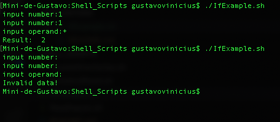

# Shell Scripts

## Enable Permission
```

chmod u+x script.sh

./script.sh

```

### Sum two numbers at a single line
```sh
read -p "a:" a; read -p "b:" b; echo $((a + b))
```

### Notes

```

read -p "input number:" a # reads input and sets on variable

if [ $a -a $b ] # if a and b is set

if [ $a -o $b ] # if a or b

if [ -z $a ] # if a is set

echo `expr $a $operand $b` # evaluates expression

read -r x; read -r z; echo `expr $x + $z`

```


